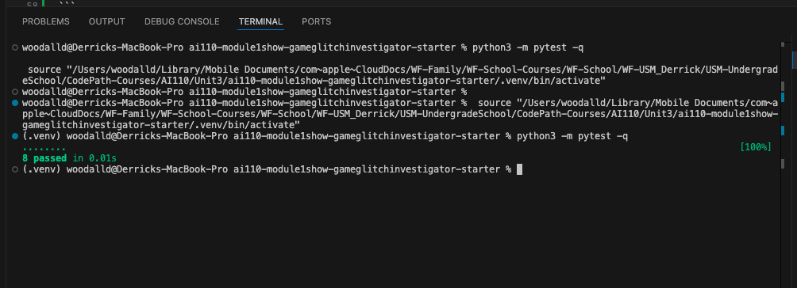
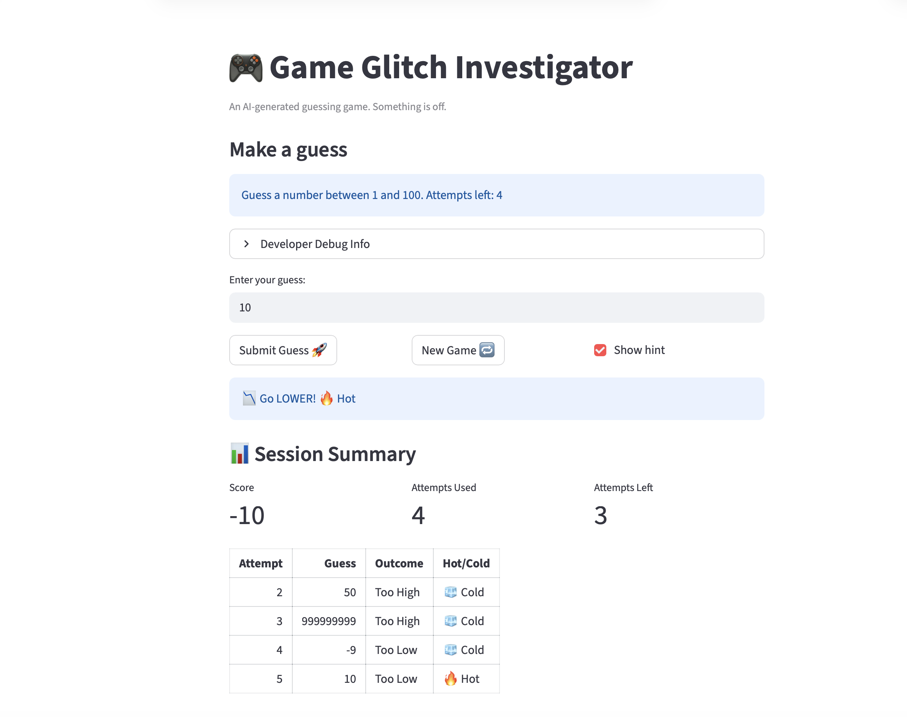

# 🎮 Game Glitch Investigator: The Impossible Guesser

## 🚨 The Situation

You asked an AI to build a simple "Number Guessing Game" using Streamlit.
It wrote the code, ran away, and now the game is unplayable. 

- You can't win.
- The hints lie to you.
- The secret number seems to have commitment issues.

## 🛠️ Setup

1. Install dependencies: `pip install -r requirements.txt`
2. Run the broken app: `python -m streamlit run app.py`

## 🕵️‍♂️ Your Mission

1. **Play the game.** Open the "Developer Debug Info" tab in the app to see the secret number. Try to win.
2. **Find the State Bug.** Why does the secret number change every time you click "Submit"? Ask ChatGPT: *"How do I keep a variable from resetting in Streamlit when I click a button?"*
3. **Fix the Logic.** The hints ("Higher/Lower") are wrong. Fix them.
4. **Refactor & Test.** - Move the logic into `logic_utils.py`.
   - Run `pytest` in your terminal.
   - Keep fixing until all tests pass!

## 📝 Document Your Experience

- [x] **Describe the game's purpose.**
   The purpose of the game is to let the player guess a secret number within a limited number of attempts, with feedback after each guess and a score that updates based on outcomes.
- [x] **Detail which bugs you found.**
   I found that hint direction was reversed (for example, a high guess could show a higher-style hint), and there were state/reset issues that made a new game unreliable. I also found logic/test mismatches where `check_guess` behavior did not align with expected test outcomes until refactoring was completed.
- [x] **Explain what fixes you applied.**
   I moved and implemented guess logic in `logic_utils.py`, corrected hint direction (high guess → go lower, low guess → go higher), and added a regression test to catch the reversed-hint bug. I also updated tests to validate the `(outcome, message)` return format and confirmed all tests pass with `pytest` (`4 passed`).

## 📸 Demo

- [X] [Insert a screenshot of your fixed, winning game here]

### Challenge 1: Advanced Edge-Case Testing

- Added edge-case tests for:
   - Negative input (example: `-7`)
   - Decimal input (example: `42.9`)
   - Extremely large integer input (example: `999999999999999999999999999999`)
   - Non-numeric input (graceful error handling)

- Pytest command used:

```bash
python -m pytest -q
```

- Test result:

```text
........                                                                 [100%]
8 passed in 0.03s
```

- Screenshot (replace with your captured terminal image):



## 🚀 Stretch Features

- [x] Challenge 4: Enhanced Game UI completed.

### Challenge 4: Enhanced Game UI

- Added color-coded feedback output for guess hints (`Too High`, `Too Low`, `Win`).
- Added emoji-based hot/cold feedback (`🔥 Hot`, `🌤️ Warm`, `🧊 Cold`, `🎯 Spot on`).
- Added a session summary area with score metrics and a table of attempts.

- Screenshot of enhanced player experience (replace with your captured image file):


